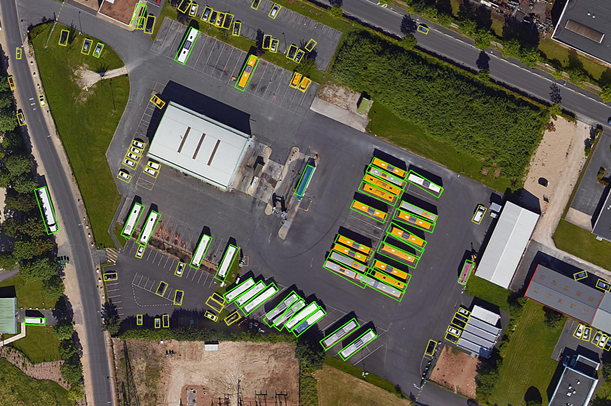
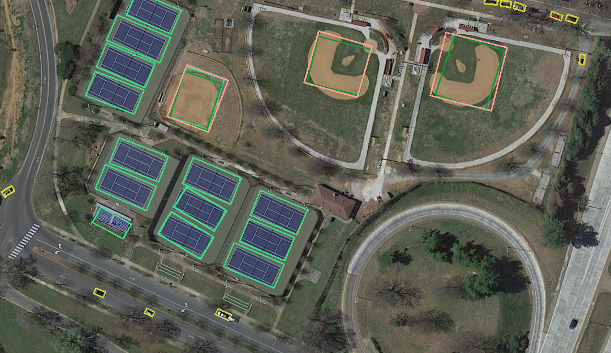
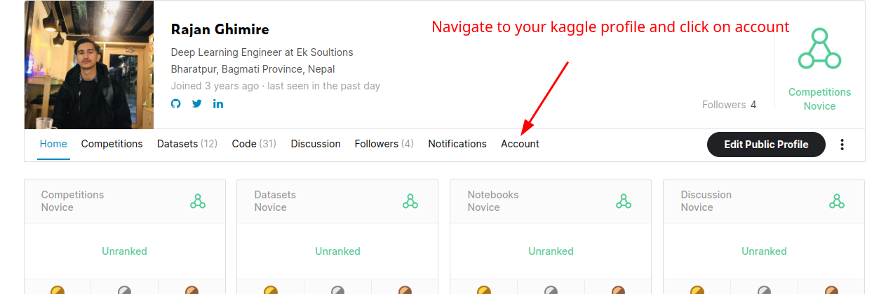
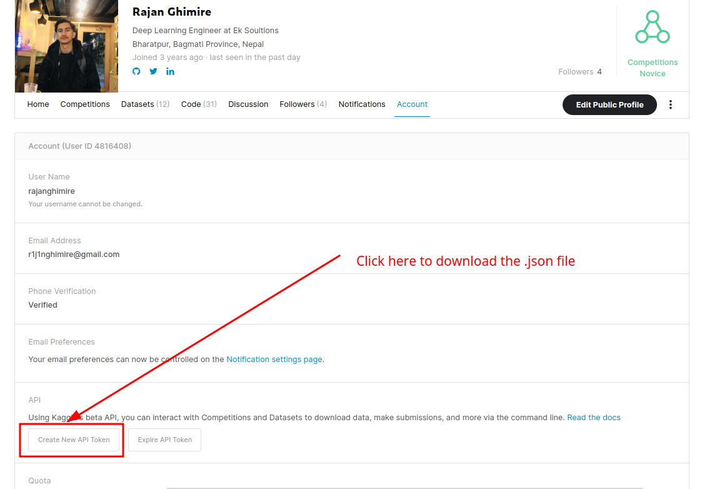
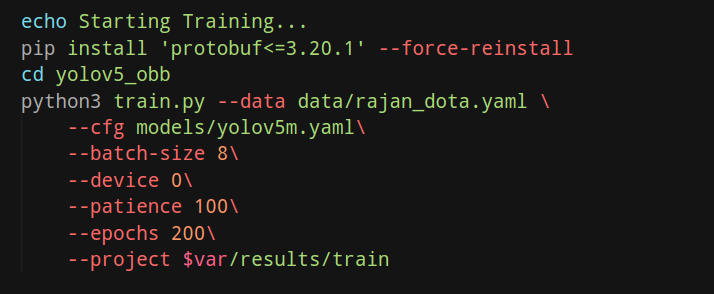
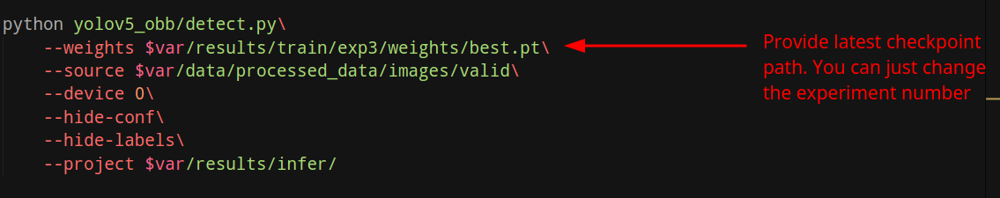
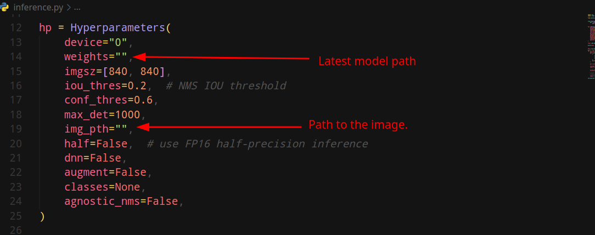

# Orientation free object detection:
Orientation-free object detection refers to a type of object detection algorithm that can detect objects in images or videos without relying on their specific orientation or pose. Traditional object detection algorithms typically rely on identifying specific features of the object, such as edges or corners, which can be highly dependent on the object's orientation. Orientation-free object detection algorithms, on the other hand, aim to identify objects in their respective orientation. 

This repo is the direct clone of [this repo](https://github.com/hukaixuan19970627/yolov5_obb). The main aim is to simplify the training task and provides end-to-end training procedure, from data download, data preparation, training, and testing. 
<p align="center" >

</p>
<p align="center" >

</p>

### Step 1: Environment setup.
* * * 
You must have already installed cuda and cudnn.
Use  ```nvidia-smi``` and ```nvcc -V``` to check availablity.

Execute the following command to install and activate environment.
```
source install_env.sh 

```


### Step 2: Downloading the data.
* * * 
In order to download the dataset, first you need to download your Kaggle API key. Please follow the following steps to download the dataset. 
<p align="center" >

</p>
<p align="center" >

</p>

After you downloaded the dataset, paste the ```kaggle.json``` file into the data directory and run:
```
get_data.sh
```


### Step 3: Training
* * * 
Now run the following to train the model:<br>
```
bash train.sh  
```
If you want to change some basic training parameters, open the ```train.sh``` file. 
<p align="center" >

</p>

After the training completes, you can find the logs and checkpoints inside the ```resutls/train/exp{}``` directory.


### Step 4: Testing
* * * 
Now run the following to test the model:<br>
```
bash test.sh  
```
If you want to change some basic test parameters, open the ```test.sh``` file. 
<p align="center" >

</p>

After the training completes, you can find the results inside the ```resutls/infer/exp{}``` directory.


### Step 5: Inference 
* * * 
Now, if you want to use the model for real life inference you can simply use the ```infer.py```. Just do some changes on the hyperparameters files.
<p align="center" >

</p>

It returns the response in the following format: 
```
{0: 
    {'polygons': [906, 241, 901, 254, 870, 242, 876, 228], 
    'class': 4, 
    'conf': 0.6164751052856445}, 
1: {'polygons': [801, 869, 808, 881, 781, 897, 774, 885], 
    'class': 4, 
    'conf': 0.6235656142234802}
}
```